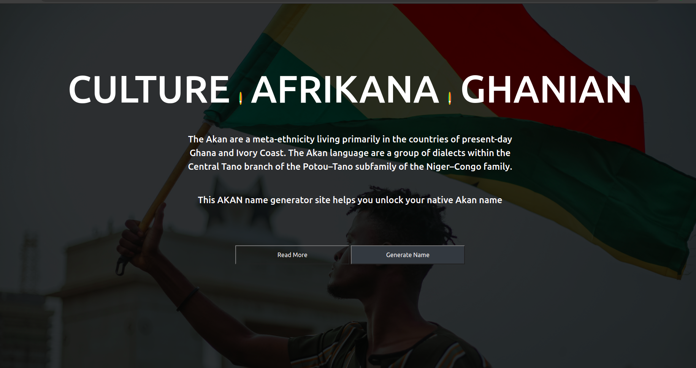

## Name Generator

## By Blaise Hala

Akan name generator based on the day and date one was were born.

#Table of Content

[Akan Name Generator - Blaise Hala](#name-Generator)

[Table of Content](#table-of-content)
[Description](#description)
[Installation](#Installation)
[Requirements](#requirements)
[Installation Process](#Installation-process)
[Site Screenshot](#site-screenshot)
[Behavior Driven Development](#behavior-driven-development)
[Live Link](#Live-Link)
[Technology Used](#technology-used)
[Reference](#reference)
[Licence](#licence)
[Authors Info](#authors-info)

##Description
The Akan are a meta-ethnicity living primarily in the countries of present-day Ghana and Ivory Coast. The Akan language are a group of dialects within the Central Tano branch of the Potou–Tano subfamily of the Niger–Congo family.

This AKAN name generator site helps you unlock your native Akan name

##Installation
Requirements
Either a computer,phone,tablet or an Ipad

browser

An access to the Internet

Installation Process

[Go Back to the top](#name-generator)

## Site Screenshot
 

## Behavior Driven Development

Specification: Akan Name Generator

When date of birth and gender are inputted in a form to generate Akan day names Then it is calculated to get day born which is equated to an akan name depending on the gender.

When a date is keyed in wrongly Then an alert message is sent to the user.

When gender selected is male Then Akan name generated is for male users. And the day of birth is also generated and displayed to the user.

When gender selected is female Then Akan name generated is for female users. And the day of birth is also generated and displayed to the user.

##Live Link 
here is the link to the site

## Technology used
HTML - used to build the structure of the pages.

CSS - Used  styling of the webpages

JavaScript - Used for addition of functionality 

## Reference
Materialize CSS
[Javascript Forms](#https://www.javascripttutorial.net/javascript-dom/javascript-form/)

## Licence

MIT License

Copyright (c) [2021] [Blaise Hala Odhiambo]

Permission is hereby granted, free of charge, to any person obtaining a copy of this software and associated documentation files (the "Software"), to deal in the Software without restriction, including without limitation the rights to use, copy, modify, merge, publish, distribute, sublicense, but not to sell copies of the Software, and to permit persons to whom the Software is furnished to do so, subject to the following conditions:

The above copyright notice and this permission notice shall be included in all copies or substantial portions of the Software.

THE SOFTWARE IS PROVIDED "AS IS", WITHOUT WARRANTY OF ANY KIND, EXPRESS OR IMPLIED, INCLUDING BUT NOT LIMITED TO THE WARRANTIES OF MERCHANTABILITY, FITNESS FOR A PARTICULAR PURPOSE AND NONINFRINGEMENT. IN NO EVENT SHALL THE AUTHORS OR COPYRIGHT HOLDERS BE LIABLE FOR ANY CLAIM, DAMAGES OR OTHER LIABILITY, WHETHER IN AN ACTION OF CONTRACT, TORT OR OTHERWISE, ARISING FROM, OUT OF OR IN CONNECTION WITH THE SOFTWARE OR THE USE OR OTHER DEALINGS IN THE SOFTWARE.

[Go Back to the top](#name-generator)

## Authors Info 
I am self-driven and passionate about Software development and all types of art, especially camera works. I take each day as a learning opportunity and seek to develop new skills .

Linked - [Blaise Hala](https://www.linkedin.com/in/blaise-hala-682aa511a/)

Github - [Blaise Hala](https://github.com/Blaisehala)

[Go Back to the top](#name-generator)
